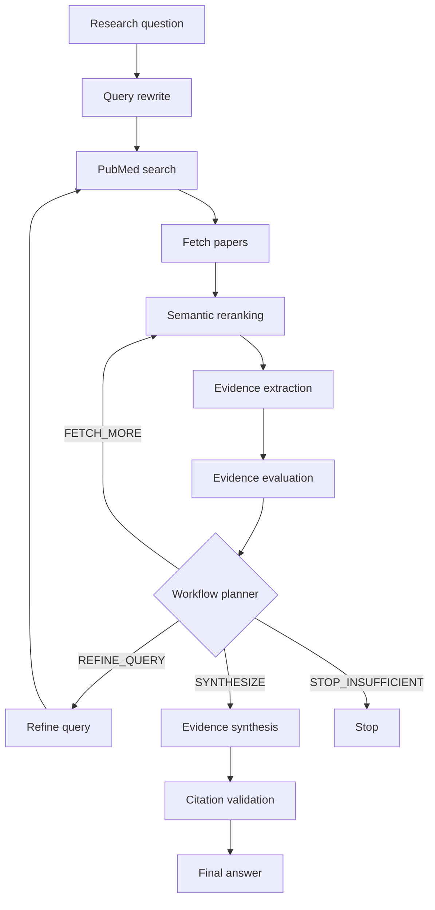

# Biomedical Evidence Agent

A bounded agentic RAG system for retrieving, evaluating, and synthesizing biomedical evidence from PubMed.

The agent converts a natural-language research question into a PubMed query, retrieves candidate papers, reranks them using semantic embeddings, extracts structured evidence with a local LLM, evaluates evidence sufficiency, and either refines the search, retrieves more evidence, synthesizes a cited answer, or stops with an insufficient-evidence result.

## Key Features

- Natural-language to PubMed query rewriting
- Deterministic preservation of explicit biomedical entities
- PubMed search and batch paper retrieval
- MiniLM-based semantic reranking
- Structured LLM evidence extraction
- Pydantic schema validation and output normalization
- State-driven workflow planning
- Bounded query-refinement and retrieval loop
- Grounded multi-paper evidence synthesis
- PMID citation validation
- Command-line interface with optional reasoning trace
- Unit and integration tests with dependency injection and mocks

## Architecture



## Agent Decisions

The deterministic planner selects one of four workflow actions:

| Action | Meaning |
|---|---|
| `REFINE_QUERY` | Retrieved evidence is missing or mostly irrelevant |
| `FETCH_MORE` | Evidence is relevant but insufficient |
| `SYNTHESIZE` | Minimum evidence criteria are satisfied |
| `STOP_INSUFFICIENT` | The iteration budget is exhausted without sufficient evidence |

The workflow is bounded by `max_iterations` to control latency, model calls, external requests, and failure propagation.

## Project Structure

```text
biomedical_agent/
├── main.py
├── README.md
├── requirements.txt
├── agent/
│   ├── agent.py
│   ├── evaluator.py
│   ├── extractor.py
│   ├── llm.py
│   ├── planner.py
│   ├── query.py
│   ├── state.py
│   ├── synthesizer.py
│   ├── tools.py
│   └── validator.py
├── retrieval/
│   └── ranker.py
├── tools/
│   ├── evidence_tools.py
│   └── pubmed.py
└── test/
    ├── test_agent.py
    ├── test_agent_loop.py
    ├── test_cli.py
    ├── test_extraction.py
    ├── test_llm.py
    ├── test_planner.py
    ├── test_pubmed.py
    ├── test_query.py
    ├── test_ranking.py
    ├── test_tool.py
    ├── test_validation.py
    └── test_validator.py
```

## Core Data Models

The workflow uses typed Pydantic models:

- `AgentAction`: an executable tool request
- `ToolResult`: a normalized tool observation
- `PaperRecord`: metadata and abstract retrieved from PubMed
- `ScientificEvidence`: structured evidence extracted from one paper
- `WorkflowAction`: the next control-flow decision
- `AgentState`: shared state across retrieval iterations

## Installation

### 1. Clone the repository

```bash
git clone <repository-url>
cd biomedical_agent
```

### 2. Create an environment

Using Conda:

```bash
conda create -n biomedical-agent python=3.13
conda activate biomedical-agent
```

### 3. Install dependencies

```bash
pip install -r requirements.txt
```

### 4. Install and start Ollama

Install Ollama and download a compatible local instruction model:

```bash
ollama list
ollama pull <model-name>
```

Configure the model name in `agent/llm.py` if necessary.

The semantic reranker uses:

```text
sentence-transformers/all-MiniLM-L6-v2
```

The model is downloaded automatically on first use. If it is already cached, Hugging Face offline mode can be enabled.

PowerShell:

```powershell
$env:HF_HUB_OFFLINE = "1"
$env:TRANSFORMERS_OFFLINE = "1"
```

## CLI Usage

Basic usage:

```bash
python main.py "Is TNIK a promising therapeutic target for pulmonary fibrosis?"
```

Display the internal reasoning trace:

```bash
python main.py "Is TNIK a promising therapeutic target for pulmonary fibrosis?" --trace
```

Display CLI help:

```bash
python main.py --help
```

Example status output:

```text
Agent status:
Iterations: 1
Final decision: synthesize
Retrieved papers: 5
Usable evidence: 3
Relevance rate: 0.75
Citation valid: True
Termination reason: Sufficient evidence found.
```

## Testing

Run fast deterministic tests:

```bash
pytest test/test_query.py test/test_planner.py test/test_agent_loop.py test/test_validator.py -v
```

Run all tests:

```bash
pytest -v
```

Run integration tests while displaying output:

```bash
pytest test/test_agent.py -s
```

The integration test may access PubMed, load the semantic embedding model, and call the configured local Ollama model.

## Retrieval Evaluation

A manually annotated TNIK/idiopathic pulmonary fibrosis case was used to compare PubMed ordering with MiniLM semantic reranking.

| Method | Precision@5 | Recall@5 |
|---|---:|---:|
| PubMed baseline | 0.60 | 0.50 |
| MiniLM reranking | 1.00 | 0.83 |

This is a single-case pipeline evaluation rather than evidence of general performance across biomedical retrieval tasks.

## Reliability Design

The system combines probabilistic LLM components with deterministic safeguards:

- Query generation is followed by entity-preservation checks.
- LLM JSON is parsed, normalized, and validated with Pydantic.
- Evidence sufficiency is evaluated before synthesis.
- Agent execution is bounded by an iteration limit.
- Synthesized PMID citations must belong to validated evidence.
- Tests use fake dependencies and mocked retrieval trajectories where deterministic behavior is required.

## Known Limitations

- Biomedical entity preservation currently relies partly on uppercase-pattern matching and is not a complete biomedical named-entity recognition system.
- Evidence extraction and study-type classification depend on the quality of the configured local LLM.
- The current internal relevance rate is a workflow heuristic, not a gold-standard retrieval metric.
- Citation validation confirms that cited PMIDs belong to the evidence set, but does not yet verify claim-level entailment.
- Retrieval evaluation currently contains one manually annotated TNIK/IPF case.
- Repeated retrieval rounds do not yet use a persistent question-aware evidence cache.
- This project is a research and engineering demonstration and must not be used as a substitute for medical advice or a systematic review.

## Future Improvements

- Biomedical NER and entity normalization using MeSH/UMLS
- Claim-citation entailment verification
- Evidence hierarchy and study-quality scoring
- PMID-based extraction cache
- Multi-query retrieval benchmark
- Persistent agent state
- Human review for uncertain or conflicting evidence
- LangGraph-based workflow orchestration

## Disclaimer

This software is intended for research and educational purposes. Its outputs may contain errors and require expert verification. It does not provide medical advice.